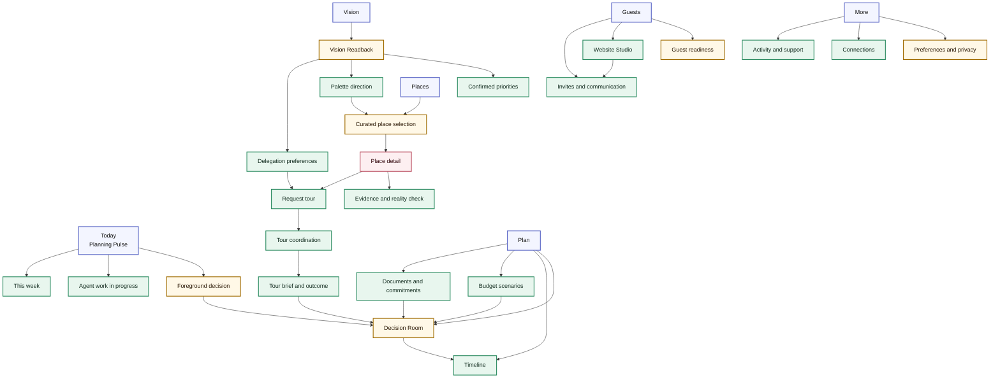
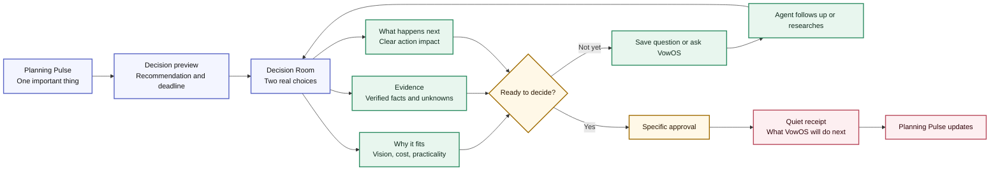

# Project VowOS UI and Experience Plan
## Calm enough to trust. Warm enough to love.

**Status:** Visual and interaction direction, version 1.1  
**Product stance:** A premium, execution-first wedding agent. Not a marketplace dashboard and not a generic “AI wedding planner.”

> **Design ambition:** Apple-like in clarity, restraint, craft, and confidence. Airbnb-like in warmth, hospitality, visual storytelling, and the way trust is made visible. The result should feel personal and beautiful without becoming precious, busy, stereotypically bridal, or overly feminine.

## 1. The visual feeling

The interface should feel like a calm room where someone capable is already helping. A user should open VowOS and immediately understand what matters today, what has moved forward, and what deserves their attention. The product must lower the emotional temperature of wedding planning, not amplify it with a dense dashboard, constant badges, celebration animations, or dozens of competing cards.

The design should be attractive to women because it is **thoughtful, emotionally intelligent, high quality, and respectful of taste**, not because it defaults to pink, florals, script type, or stereotyped bridal imagery. It must also feel equally natural for both partners, couples across cultures and identities, family contributors, and professional planners. The aesthetic is editorial, hospitable, and modern: soft daylight, tactile paper, a few exceptional photographs, quiet typography, and plenty of air.

| Reference quality | What to borrow | What to avoid |
|---|---|---|
| Apple | One clear primary action, strong hierarchy, disciplined spacing, tactile controls, legible typography, quiet confidence | Cold clinical minimalism, feature overload hidden behind icon-only navigation, excessive glass effects |
| Airbnb | Human warmth, place-based imagery, trust cues, inviting cards, generous margins, clear hospitality language | Marketplace density, endless search-result grids, promotional urgency, overly rounded “travel app” styling |
| High-end editorial | A considered serif moment, artful image crops, restrained color, considered rhythm | Bridal clichés, script-font overload, precious decoration, unreadable thin type |
| VowOS | Calm agent presence, evidence made approachable, shared couple decisions, progress without pressure | Robot avatars, chat-first clutter, gamified planning, synthetic “AI” gradients |

## 2. Design principles

### 2.1 One meaningful action per moment

Every screen has one main action and a small number of supporting choices. The user should not have to scan a dashboard to figure out what to do. The Planning Pulse opens with one sentence, one important item, and an optional view of everything else.

### 2.2 White space is functional

White space is not decorative. It separates emotional decisions from logistical detail, makes high-stakes decisions less intimidating, and signals that the product has already organized the complexity. Use generous page margins, restrained cards, and visible breathing room between unrelated sections.

### 2.3 Beauty must earn its place

Images, color, motion, and decorative texture should reinforce a real decision or create a sense of welcome. A venue photograph belongs next to a match explanation. A palette belongs beside an accepted visual direction. A paper-like surface can distinguish a personal note from a system notification. Do not add decoration merely to make a functional interface feel “wedding themed.”

### 2.4 Make the agent feel present, never invasive

VowOS should speak in short, grounded sentences and use a subtle editorial marker rather than a cartoon assistant. Its presence lives in useful summaries, clear next steps, calm check-ins, and visible evidence. It does not need a floating chat orb, an animated face, or constant “I am thinking” behavior.

### 2.5 Trust is visible, not buried

Every recommendation, source-sensitive fact, sent email, and delegation rule should be visible at the moment it matters. Trust UI should feel light, not legalistic: “Verified by the venue on June 8,” “You asked us to follow up once,” “We have not confirmed this fee yet.” This reflects the principle that trust must be designed into the interaction itself. [3]

### 2.6 The relationship is shared

The interface never assumes one partner is carrying the work. Shared decisions are clear, permissions are gentle, and personal preferences can be private. A partner should see the other’s perspective without feeling surveilled or overridden.

## 3. Visual territory

### 3.1 Color system

The palette starts in warm whites and ink, then uses color with restraint. It should feel closer to high-quality stationery and natural interiors than a conventional wedding app. The couple’s accepted palette can appear as a contextual accent within their workspace, but product navigation and critical interaction states must remain stable and accessible.

| Token | Suggested color | Role | Usage rule |
|---|---|---|---|
| Porcelain | `#FCFBF8` | Default canvas | Primary page background, never pure high-glare white by default |
| Paper | `#F5F1EA` | Soft surface | Readbacks, notes, empty spaces, secondary panes |
| Ink | `#1D1C1A` | Primary text | All key text and icons; use for strong contrast |
| Ash | `#6D6A66` | Secondary text | Metadata and supporting explanations only, never for critical actions |
| Moss | `#345A4A` | Grounded affirmative accent | Confirmed, trusted, or ready states; use sparingly |
| Terracotta | `#A95842` | Warm action accent | Primary CTA or a single expressive action within a view |
| Rose clay | `#DAB5A6` | Gentle personal accent | Decorative fills, selected palette previews, never the only status signal |
| Mist blue | `#DDE7EC` | Informational wash | Calendar, travel, neutral planning context |
| Soft gold | `#D6B56F` | Highlight | Rare emphasis, achievement, or a meaningful selected detail |
| Alert | `#B53F3A` | Error or urgent risk | Reserved for errors, not ordinary attention states |

The exact production values must be tested in context. Body text should meet the WCAG AA 4.5:1 contrast threshold against its background; large text may use the 3:1 threshold, but the design should aim beyond minimum compliance when possible. [4]

Porcelain and Paper sit close together by design, but that closeness is a risk as well as a virtue. On lower-quality displays or in direct daylight, the two surfaces can read as indistinguishable, which removes the layering they are meant to provide. Test both against a mid-range phone panel at outdoor brightness, not only a calibrated monitor, before locking production values.

### 3.2 Typography

Typography should carry much of the luxury. It should feel clear first, editorial second. Apple’s typography guidance emphasizes legibility, hierarchy, minimal typeface choices, and avoiding light weights for small text. [2]

| Role | Recommended direction | Desktop scale | Mobile scale | Notes |
|---|---|---:|---:|---|
| Display | Accessible editorial serif, such as Newsreader or a licensed equivalent | 48 to 60 px | 34 to 42 px | Use only for welcome moments, page titles, and large venue stories |
| UI and body | System UI stack, SF Pro on Apple systems, then Inter or equivalent | 16 to 18 px body | 16 to 18 px body | Default text must feel effortlessly readable |
| Decision title | UI sans, semibold | 24 to 32 px | 22 to 28 px | Do not use serif in dense operational views |
| Labels | UI sans, medium | 12 to 14 px | 12 to 14 px | Keep concise, sentence case, and never all caps by default |
| Metadata | UI sans, regular | 13 to 14 px | 13 to 14 px | Use ink or ash with enough contrast |

Use no more than two type families. The serif brings an editorial note at low frequency; the sans does the functional work. This creates polish without turning the product into a wedding invitation.

### 3.3 Shape, surface, and imagery

| Element | Direction | Avoid |
|---|---|---|
| Cards | Large radius, 20 to 24 px, quiet border or very soft shadow, generous internal padding | A wall of cards, nested cards, heavy shadows, multicolored category boxes |
| Buttons | 12 to 14 px radius, decisive filled primary action, calm secondary outline or text action | Pill-shaped buttons everywhere, gradient buttons, too many colors |
| Inputs | Full-width with clear labels, 12 px radius, visible focus ring, supportive helper text | Placeholder-only forms, ultra-thin borders, floating labels that obscure content |
| Dividers | Hairline warm gray or spacing alone | Frequent hard rules that fragment the screen |
| Photography | Full-bleed only when it earns the moment; otherwise a single framed image with a clear relation to the decision | Generic stock couples, collage mosaics, low-quality copied venue images |
| Icons | Simple line icons with filled selection state, aligned to type weight | Decorative wedding icons, rings, bows, hearts, or confetti as navigation |
| Motion | 160 to 240 ms ease-out, gentle surface transitions, content moves a short distance | Bouncy animation, elaborate loading sequences, celebratory effects after routine actions |

## 4. Emotional states the UI must support

Wedding planning has different emotional moments. The design should shift its density, not its brand personality.

| State | User need | UI behavior | Example language |
|---|---|---|---|
| Hopeful beginning | Feel seen and inspired | Warm, image-led, one-question onboarding | “Tell us about the day you want to create.” |
| Overwhelmed | See a manageable next step | Reduce information, show one foreground decision | “There is one thing worth deciding this week.” |
| Curious exploration | Compare without commitment | Spacious imagery, reasons, easy save or reject controls | “Here are five places that fit the feeling you described.” |
| High-stakes decision | Understand tradeoffs and remain in control | Evidence forward, calm hierarchy, no urgency styling unless a real deadline exists | “This hold ends tomorrow at 5 p.m. Here is what changes if you let it go.” |
| Shared alignment | See both perspectives without conflict | Visible but gentle partner notes and decision-ready state | “Alex is ready to review. Maya added one question about the ceremony space.” |
| Partner disagreement | Disagree without the product taking a side or forcing resolution | Show both positions plainly, side by side, with no “winning” state; offer a neutral next step rather than a merged or averaged answer | “Maya prefers The Orchard House. Alex prefers Maison 98. Nothing moves forward until you both approve.” |
| Relief | Feel progress without gamification | Quiet confirmation and a clear next look-ahead | “The tour is confirmed. We will prepare your questions the day before.” |
| Wedding-week focus | Trust the system under pressure | Minimal visual noise, operational checklist, critical contact access | “Everything is ready. Two confirmations need your coordinator.” |

## 5. What the product must never look like

VowOS should reject conventional wedding-tech tropes. It should not resemble an ad-heavy vendor portal, a Pinterest clone, a wedding checklist with hundreds of checkmarks, a generic SaaS analytics dashboard, or a chat interface dressed up with flowers. It should avoid saturated blush backgrounds, thin gray text, script headlines, cutesy icons, artificial confetti, default “bride” assumptions, and excessive progress meters.

The visual test is simple: if removing the wedding labels makes the screen look like a generic task manager, it has failed. If adding a few flowers makes the screen look like a bridal blog, it has also failed. The screen should feel like a beautiful, competent planning environment for something important.

## 6. Design quality bar

| Quality question | Passing condition |
|---|---|
| Can a tired user understand the next step in five seconds? | One dominant action and one clear summary appear before the fold. |
| Does this screen feel spacious without wasting space? | Each section has a purpose, and unrelated information does not compete. |
| Could both partners feel represented here? | The language, imagery, and permissions are inclusive and not gender-coded by default. |
| Is the beauty tied to the couple’s real wedding? | Images, palette, and copy are sourced from accepted preferences and legitimate assets. |
| Are decisions explainable? | Recommendation reasons, sources, and unknowns are one interaction away. |
| Does the design retain accessibility? | Contrast, focus, type scaling, and touch targets work without sacrificing the visual system. |

## Section source notes for Sections 1 to 6

[1]: https://developer.apple.com/design/human-interface-guidelines/ "Apple, Human Interface Guidelines"
[2]: https://developer.apple.com/design/human-interface-guidelines/typography "Apple, Typography"
[3]: https://news.airbnb.com/in-the-business-of-trust/ "Airbnb, In the Business of Trust"
[4]: https://www.w3.org/WAI/WCAG21/Understanding/contrast-minimum.html "W3C, Understanding Contrast Minimum"

## 7. Information architecture

The navigation must support a complex wedding without exposing its full complexity at once. The primary structure should follow the couple’s mental model: what is happening now, what they are imagining, what they are choosing, what they are organizing, and what guests will experience. Avoid separate tools for every feature.

### 7.1 Primary workspace structure

| Workspace | User question | Primary content | What stays out of view until needed |
|---|---|---|---|
| **Today** | “What deserves our attention right now?” | Planning Pulse, one foreground decision, recent progress, quiet look-ahead | Full task list, old activity, low-priority configuration |
| **Vision** | “What are we actually creating?” | Vision Readback, accepted palette, mood direction, priorities, anti-preferences | Raw model extraction, old iterations, advanced tags |
| **Places** | “Where could this happen, and who could make it real?” | Agent-curated venue and vendor matches, saved places, tour status, fit explanations | Endless marketplace filtering, advertising, unverified leads |
| **Plan** | “Is the wedding feasible and moving?” | Budget scenarios, decisions, timeline, contracts, dependencies | Dense financial tables and operational metadata until opened |
| **Guests** | “What will our people need from us?” | Guest readiness, RSVP, event details, website and invitations | Individual guest detail unless a specific action is required |
| **More** | “Where are the details?” | Documents, website studio, notes, preference settings, connections, help | A crowded permanent sidebar |

On desktop, use a narrow left rail that contains the five workspaces, the couple’s event title, and one small status indicator. The center panel holds the main content. The right side is reserved for context only when it reduces work, such as a source panel, recent reply, approval state, or a calendar preview. It should never become a permanent third column filled with notifications.

On mobile, replace the rail with a four-item bottom bar: **Today, Vision, Places, Plan**, plus an overflow sheet for Guests and More. The current “one important thing” remains pinned at the top only when a real decision is pending. It must never block the page.

### 7.2 The Planning Pulse

Today is the home screen, but it must not look like a dashboard. It is an editorial briefing. At the top, show a short greeting, a simple event countdown, and the single best next action. Below it, show a small “moving quietly” section for agent work that is underway, then a calm timeline of only the most recent changes.

| Zone | Content | Visual treatment | User action |
|---|---|---|---|
| Opening line | “Good evening, Maya and Alex.” | Large serif headline, muted event date and place | No action needed |
| Foreground decision | One request with recommendation, deadline, and impact | Full-width paper surface, one decisive action, one defer link | Review, approve, edit, or defer |
| Agent at work | Two to four quiet status lines | Light background, no spinners, simple check or clock icon | Open a work detail only if desired |
| This week | Short look-ahead of planned action | Plain text list with date anchors | Open the full plan |
| Recent progress | Two to three completed milestones | Reduced opacity and restrained checkmark | Open activity history |

**Example Planning Pulse:**

> “Two places are ready to compare.”  
> “The Orchard House and Maison 98 both fit the dinner-party atmosphere you approved. Maison 98 is closer to your target budget. The Orchard House has the later curfew.”

The action is **Compare places**. It is not “View task” or “AI recommendation available.”

## 8. First-session flow

The first session needs to feel like a conversation with a talented planner who has made room for the couple. It should not resemble an onboarding form or a generative-AI demo.

| Step | Screen purpose | Key interaction | UI direction |
|---|---|---|---|
| 1. Welcome | Explain value and establish calm | Choose “Tell us out loud,” “Start with images,” or “Answer a few questions” | Mostly white space, one warm image crop, one primary CTA |
| 2. Tell us | Capture a free-form vision note | Record or type, with optional prompts that appear only if needed | Large recording field, live but unobtrusive transcript, no chatbot bubbles |
| 3. Practical anchors | Capture date range, guest count, location, and budget comfort | Four quiet fields, each with a human explanation | Single-column progression, no wall of options |
| 4. Vision Readback | Show what VowOS heard | Confirm, correct, or mark uncertainty | Elegant editorial summary with “Confirmed,” “We heard,” and “Tell us more” labels |
| 5. Palette direction | Turn visual signals into a co-created design choice | Compare three directions, adjust or accept one | Large color swatches, real spatial imagery, minimal descriptive copy |
| 6. First plan | Show what the agent will do next | Choose search priority and delegation level | One short plan and a bounded approval explanation |
| 7. First shortlist | Deliver the proof moment | Save, reject, compare, or approve inquiry pack | Five to seven spacious cards, no grid overload |

### 8.1 Vision Readback screen

This is the first defining VowOS screen. Its job is to prove understanding without pretending certainty. Use a two-column desktop layout. The left side has a single full-height image or an abstract palette composition, only if the user supplied or rights-cleared visual input. The right side has the structured readback with large breathing room.

| Section | Content | Interaction |
|---|---|---|
| “The feeling” | One short paragraph in the couple’s preferred tone | Edit directly or tap “not quite” |
| “What matters most” | Three to five confirmed priorities | Reorder, confirm, remove |
| “What we are avoiding” | Anti-preferences | Edit, add, remove |
| “The practical shape” | Date, city, guest range, budget comfort | Mark fixed, flexible, or uncertain |
| “We still need to know” | Maximum three high-value questions | Answer now or skip intentionally |
| “Visual direction” | Accepted or suggested palette and imagery cues | Explore alternatives or lock direction |

The primary CTA is **“Yes, this feels like us”**. The secondary action is **“Help us refine it.”** Avoid generic labels such as “Continue” or “Generate plan.”

## 9. Core screen hierarchy

### 9.1 Places, the curated selection experience

Places should feel like a private viewing room, not a marketplace. The default view shows at most five recommended venues, each with a large image, a one-sentence reason, source freshness, and a simple fit signal. It should not show star ratings, ad labels, dozens of filters, review count, or a map packed with pins.

| Place card element | Content | Visual rule |
|---|---|---|
| Hero image | Official, licensed, or rights-cleared image | One dominant crop, 4:3 ratio, no collage |
| Place name and location | Name, neighborhood or travel context | Large title, short supporting location line |
| “Why it fits” | Two evidence-backed reasons tied to accepted priorities | Plain language, no score jargon |
| Reality check | One tradeoff or unknown | Muted but visible, never concealed below the fold |
| Status | Suggested, saved, contacted, tour proposed, toured, or ruled out | Small textual marker, not a colorful status pill |
| Action | Save, compare, ask VowOS to contact, or rule out | One primary action based on current state |

Tapping a venue opens a quiet detail page. It begins with a gallery and the plain-language fit summary, then moves into capability, budget scenario, agent evidence, and a collapsible “what we still need to verify” section. The action remains contextually specific, such as **“Ask VowOS to request a tour”**.

### 9.2 Tour coordination screen

The tour screen should feel almost like an assistant placing a thoughtful calendar invitation. It shows the venue, a one-line reason for visiting, travel time from the selected origin, two or three proposed windows, and exactly what happens after confirmation.

The layout uses a soft date rail on the left and large time choices on the right. The primary action is **“Ask for this time”** until the venue confirms. After confirmation, it becomes **“Add to our calendars.”** The UI should never imply that the system has booked something when it has merely proposed a time.

### 9.3 Decision Room

The Decision Room deserves the most visual restraint. It is for moments with money, emotions, or irreversible choices. Default to comparing two choices side by side on desktop, with a third choice available through a simple switcher. On mobile, compare one place at a time with a persistent “Compare with” control.

| Decision Room layer | What it answers | Presentation |
|---|---|---|
| Recommendation | “What does VowOS think, and why?” | One calm sentence at the top, with an expandable evidence drawer |
| Choice summary | “What are these options?” | Two wide, image-led summary panels |
| Fit | “Which one suits our vision?” | Plain-language strengths and one tension per option |
| Cost | “What changes in our plan?” | Clean amounts and scenario impact, not a spreadsheet by default |
| Practicality | “Can this actually work?” | Capacity, accessibility, date, curfew, transport, and rain-plan facts |
| Evidence | “Where did this come from?” | Dated source chips and original documents one layer deeper |
| Action | “What happens if we choose?” | Specific approval action, named impact, no ambiguous confirm button |

If both partners are required to approve and their choices differ, the Decision Room must show both positions without implying either one is correct or “ahead,” and must hold the decision open rather than defaulting to one partner’s pick after a delay. The UI should offer a next step, such as a shared note thread or a request for one clarifying fact, rather than a tie-breaking mechanic.

### 9.4 Plan view

The Plan workspace should appear as a gently structured timeline, not a project-management board. Events, decisions, contracts, and next actions live on a single scrollable rail, with a budget health summary at the top. Users can move between “Now,” “Next,” and “Later,” but the default view only shows the next six to eight weeks.

A plan item expands in place, rather than opening a new task detail screen for every action. Completed work is visually quiet, not celebratory. Blocked work is framed as a clear question or dependency, not a red error state unless the risk is urgent.

### 9.5 Guests and website studio

Guests must feel like people, not rows in a CRM. The default Guests screen is a readiness view with household-level clusters and a few meaningful segments: needs RSVP, traveling, accessibility or meal detail incomplete, and ready. Individual guest records appear only when a user needs to act.

The Website Studio should have a simple live preview in the center, with an unobtrusive content rail. Sections are shown as editorial chapters, not draggable blocks by default. The couple can adjust the palette, type pairing, and page modules, but the interface preserves a high-quality layout baseline. Every update shows what information will change and whether guest-facing content requires review before publishing.

## 10. Visibility rules

A high-quality interface is defined by what it refuses to show. VowOS should employ progressive disclosure with conviction.

| Information | Default visibility | When it appears |
|---|---|---|
| Full agent activity log | Hidden | User opens “What VowOS is doing” |
| Underlying source records | One layer deeper | User taps evidence or needs to approve a material action |
| Complex budget line items | Collapsed | User explores a scenario or a category has risk |
| Advanced matching tags | Hidden | User opens “Why this fit” or adjusts preferences |
| Guest personal information | Restricted | Authorized person opens the individual record for a purpose |
| Delegation rules | Condensed sentence | User is about to authorize action or opens settings |
| AI confidence and uncertainty | Human wording | A fact is not verified or an inference needs confirmation |
| Historical noise | Suppressed | User opens a timeline or activity history |

The guiding question is, “Would this help a couple decide or feel calmer right now?” If the answer is no, the information belongs one layer deeper.

## 11. Design system specifications

### 11.1 Spacing and layout

The interface should use a deliberate spacing scale. Generosity comes from consistent rhythm, not from giant empty panels.

| Token | Value | Intended use |
|---|---:|---|
| `space-1` | 4 px | Icon and label adjustments |
| `space-2` | 8 px | Tight related metadata |
| `space-3` | 12 px | Button internals and field label separation |
| `space-4` | 16 px | Standard component padding |
| `space-5` | 24 px | Card padding and related section grouping |
| `space-6` | 32 px | Distinct content groups |
| `space-7` | 48 px | Page-section separation |
| `space-8` | 64 px | Major page rhythm |
| `space-9` | 96 px | Hero and welcome moments |

Desktop content should sit in a 12-column fluid grid, with a maximum main-content width of 1,280 px. The page needs an outer margin that grows at wide breakpoints. On normal desktop screens, the primary content area should usually be 760 to 900 px wide, which makes decision text and comparison content comfortable to read. Use full width only for maps, galleries, or a two-choice comparison.

### 11.2 Component language

| Component | Purpose | Design rule |
|---|---|---|
| Primary button | Commit to the next meaningful action | One per visible decision area; terracotta fill, ink or white text based on contrast |
| Secondary button | Offer a safe alternative | Quiet outline or text treatment, never competes with the primary button |
| Quiet action | Support a low-stakes reversible action | Ink text with subtle underline or arrow; never looks like a hidden link |
| Decision surface | Frame a high-value recommendation or approval | Warm paper background, 24 px radius, clear heading, evidence line, single CTA |
| Place card | Present one venue or vendor match | One hero image, one reason, one reality check, one action |
| Evidence line | Show source, freshness, and certainty | Small text plus a restrained check, clock, or document icon, never a technicolor badge |
| Agent note | Explain what VowOS is doing or why | Left rule in moss or terracotta, short first-person sentence, no chat bubble |
| Partner note | Surface shared input without conflict | Person initials, concise direct quote or status, optional reply action |
| Timeline row | Show next work, confirmed work, or risk | Date left, clear sentence right, status by text and icon, never color alone |
| Bottom sheet | Focus mobile choices or details | Large top radius, visible close control, no more than one scroll region |
| Toast | Confirm low-stakes action | Bottom-right on desktop, bottom above tab bar on mobile, disappears without stealing attention |

Terracotta is the only primary-button fill in the system, which is correct for calm consistency but means color alone cannot distinguish a reversible action, such as saving a venue, from an irreversible or financially material one, such as approving a contract or sending an inquiry pack. High-commitment primary actions should carry a named consequence in the button label or an adjacent summary line (see the Agent language patterns table below), rather than a second accent color, so the visual system stays disciplined while the stakes stay legible.

### 11.3 Agent language patterns

The agent should write like a calm, capable member of the planning team. It uses direct sentences, dates instead of vague time words, and concrete next actions. It does not perform personality, apologize excessively, or use productivity-software jargon.

| Situation | Preferred UI language | Avoid |
|---|---|---|
| Work begun | “I have sent the five venue inquiries you approved.” | “Your AI workflow has been initiated.” |
| Waiting | “We are waiting on two replies. I will follow up on Thursday if they have not responded.” | “Pending response status.” |
| Missing fact | “The service charge is not confirmed yet. I will ask before we compare totals.” | “Estimated total: $19,000” when the estimate excludes known unknowns |
| Decision | “Maison 98 keeps more of your budget available for food and music. The Orchard House gives you the later curfew.” | “Option A has an 87 percent compatibility score.” |
| Partner update | “Alex has reviewed the tour options. Maya, the next decision is yours.” | “User 2 completed task.” |
| Gentle correction | “I may have read this wrong. Is the ceremony indoors or outdoors?” | “Confidence is below threshold.” |
| Confirmation | “The tour is confirmed for Tuesday, June 14 at 5:30 p.m.” | “Success! Booking action complete.” |

### 11.4 Interaction behavior

Every interaction should have a clear input, visible system behavior, and reassuring outcome. Motion should clarify a state change, not create spectacle.

| Interaction | Expected behavior | Visual motion |
|---|---|---|
| Saving a venue | Card shifts into “Saved” state and moves to the saved collection only if the user navigates there | 180 ms opacity and position transition |
| Rejecting a venue | Ask for an optional one-tap reason, then remove it from the foreground | Card gently collapses; no punitive confirmation |
| Approving inquiry pack | Show exact recipients and a final send summary, then a compact sent state | Surface transitions to a receipt-style confirmation |
| Agent working | Show a calm status line with current step and expected update time | No looping spinner unless a sub-second progress indication is necessary |
| Revealing evidence | Expand in place rather than opening a modal | 160 ms height transition, preserve reading position |
| Selecting palette | Swatches enlarge slightly and reveal applications | 160 ms scale and border transition |
| Editing vision | Inline editable text with tracked “what changed” status | No page jump; retain current scroll position |
| Comparing places | Toggle comparison focus without losing current option state | Crossfade content, preserve anchor controls |
| Publishing website update | Show change preview, then publish confirmation with guest impact | No confetti; offer “View as guest” |

### 11.5 Loading, empty, and error states

A premium product treats waiting as a designed state. Avoid generic skeletons that make the experience feel unfinished for long-running agent work. Use specific status language, an expected next update, and an option to step away.

| State | UI treatment | Example |
|---|---|---|
| Short loading | Quiet skeleton that mirrors final layout | Venue card image and text blocks appear for under one second |
| Active agent work | Status surface with the actual current step and expected completion window | “Reading the three proposals. I will have a comparison ready in about two minutes.” |
| No results | Explain the constraint conflict and propose the most useful adjustment | “Nothing fits all five requirements yet. Would you rather widen the date range or the travel radius?” |
| Source unavailable | Preserve what is known, label gap, and offer verification action | “The venue’s 2027 package is not published. I can request it.” |
| Error | State what happened and what was not done | “This email was not sent. No venue received it.” |
| Permission missing | Explain why the connection helps and offer a non-connected path | “Connect a calendar to see shared free time, or choose times manually.” |

## 12. Responsive behavior

The visual standard must carry from a 15-inch laptop to a phone used in a coffee shop. Responsive design should reduce competing information, not merely shrink it.

| Breakpoint | Layout behavior | Priority rule |
|---|---|---|
| Wide desktop, 1,440 px and above | Left rail, spacious main canvas, optional contextual right panel | Decision comparison can be side by side, but no more than two primary columns of content |
| Desktop and tablet landscape, 1,024 to 1,439 px | Narrow rail, single main canvas, context becomes a drawer | Keep the foreground decision and primary content visible without a three-column squeeze |
| Tablet portrait, 768 to 1,023 px | Top navigation or compact rail, single-column content with two-up cards only when useful | Move evidence and secondary information below the primary decision |
| Mobile, below 768 px | Bottom navigation, single-column cards, full-screen focused decision flows | One decision, one image, one CTA per view before scrolling |
| Small mobile, below 390 px | Increased text wrapping, reduced inline metadata, stacked actions | Preserve reading and touch targets rather than forcing density |

Touch targets should be comfortably large, at least 44 by 44 CSS pixels for primary interactive controls. Keyboard focus should be visible, persistent, and visually aligned with the warm visual system. This is especially important because WCAG also requires a visible focus indicator that does not disappear while focus remains. [5]

## 13. Accessibility and inclusion

Warm minimalism cannot rely on low contrast, tiny labels, gesture-only controls, or visual-only state. The experience must be usable when text is enlarged, images are unavailable, motion is reduced, a screen reader is in use, or one user accesses the plan differently from their partner.

| Requirement | UI design response |
|---|---|
| Contrast | Test all production color pairs. Do not use rose clay, mist blue, or soft gold as a text color on a light surface. |
| Text scaling | Use flexible layouts, multi-line labels, and stack comparison details at large text sizes. Apple specifically recommends preserving hierarchy and minimizing truncation when text grows. [2] |
| Keyboard | Every card action, drawer, comparison control, and approval path must have logical tab order and visible focus. |
| Screen readers | Use semantic headings, descriptive action labels, status announcements for agent work, and text alternatives for meaningful venue imagery. |
| Reduced motion | Respect user preference. Remove nonessential transitions and never depend on movement to convey outcome. |
| Color independence | Pair every status color with icon and plain language, such as “Needs review” or “Confirmed.” |
| Inclusive wording | Use “partner,” “you both,” “your people,” and names supplied by the couple. Never default to bride, groom, husband, wife, or heterosexual examples. |
| Cultural flexibility | Treat traditions and language as configurable content and private preferences, not decorative options in a template. |
| Privacy | Show why sensitive information is requested and who will see it before the user enters it. |
| Internationalization and RTL | Treat the editorial serif and generous negative space as defaults to validate per language, not universal constants. Confirm mirrored layout in right-to-left languages, and confirm the display serif and spacing scale still read as premium, not sparse or broken, in dense scripts such as CJK before committing the type system globally. |

## 14. Imagery and personalization rules

The brand should not use generic engagement photography as filler. Images need to be either real venue imagery with rights and provenance, couple-provided visuals used under the correct permission, or abstract editorial composition that does not pretend to be their wedding.

| Image use | Allowed approach | Design note |
|---|---|---|
| Venue match | Official or licensed image with rights metadata | Keep one large crop and source acknowledgement where required |
| Vision readback | Couple-provided or authorized Pinterest visual with proper scope | Make it clear that it informs the direction, not that VowOS owns it |
| Palette | Generated color composition from accepted directions | Use as a tactile swatch surface, not a full-page decorative background |
| Empty state | Minimal abstract paper, texture, or architectural crop | Avoid stock couples and cartoon illustrations |
| Guest website | Couple-chosen image, rights-cleared photo, or imagery-free editorial template | Provide safe crop and contrast tools |
| Product marketing | Art-directed, authentic celebration or hospitality imagery with inclusive casting | Favor real moments and environments over posed bridal shots |

## 15. Design review checklist

Before a screen advances from design to build, review it against this list.

| Question | Required answer |
|---|---|
| What is the one important action on this screen? | It is visible without scrolling and described in concrete language. |
| What can be removed or moved one layer deeper? | At least one low-priority element has been challenged. |
| Is the screen beautiful without depending on decoration? | Hierarchy, image choice, typography, and spacing carry the experience. |
| Does VowOS state only what it knows? | Every factual statement can be tied to a source or clearly identified as a suggestion. |
| Does this work for both partners? | Roles and choice states are shared, explainable, and not gender-coded. |
| Can the user understand the status without color or motion? | Text and icons make the state explicit. |
| Does the page feel calm at a glance? | It has no competing primary CTA, badge overload, or unnecessary card grid. |
| Does the content use the approved editorial rules? | No em dashes, no generic AI phrasing, no invented detail, and no placeholder leakage. |

## Section source notes for Sections 11 to 15

[5]: https://www.w3.org/WAI/WCAG22/Understanding/focus-visible.html "W3C, Understanding Focus Visible"

## 16. UI diagrams

### 16.1 Workspace hierarchy

This information architecture is intentionally shallow. Every route supports one of the couple’s real questions, and the Decision Room is reachable from Today, Places, or Plan when a meaningful choice is ready.

_Source: `docs/diagrams/vowos_ui_information_architecture.mmd`_

### 16.2 Calm decision loop

This is the primary behavioral pattern of the product. It prevents the agent from dumping information or pushing users toward a decision. VowOS presents a clear recommendation, its evidence, and the effect of action. If the couple is not ready, it returns to useful work rather than creating pressure.

_Source: `docs/diagrams/vowos_ui_decision_flow.mmd`_

## 17. First design artifacts to create next

The most valuable next move is not to design every screen. It is to make a small, highly polished prototype that proves the visual system across the product’s key emotional and operational moments. The prototype should use realistic copy and a consistent fictional couple and venue set, not lorem ipsum or placeholder dashboard data.

| Priority | Artifact | Why it comes first | Acceptance test |
|---:|---|---|---|
| 1 | **Planning Pulse, desktop and mobile** | Establishes the whole product’s calm, confident home state | A user identifies the one meaningful next action in five seconds |
| 2 | **Vision Readback** | Proves that the product can feel personal, thoughtful, and visually distinctive | A user feels understood while still seeing what is confirmed versus inferred |
| 3 | **Curated Places and place detail** | Differentiates VowOS from a marketplace | The experience feels like a curated shortlist, not an infinite vendor directory |
| 4 | **Decision Room** | Tests the highest-trust interaction | Users can explain why one option is recommended and what will happen if they approve it |
| 5 | **Tour coordination** | Shows delegated execution in a beautiful, comprehensible way | The user understands whether a time is proposed, held, or confirmed |
| 6 | **Website Studio** | Tests whether the visual personalization system feels premium without feeling AI-generated | A user can make a tasteful update without breaking the design |

A visual prototype should first target desktop at 1,440 px wide and mobile at 390 px wide. It should include both the serene, image-led Vision Readback and the information-dense Decision Room, because the design system must work in both modes. Once those six artifacts are coherent, the rest of the product can be designed with much less risk of drift.

### 17.1 Making the acceptance tests measurable

The acceptance tests above are written as design intent, not as a test protocol. Every table in this document that specifies pixels, milliseconds, or contrast ratios is checkable by inspection; the acceptance tests are not, as written. Before the prototype is used to greenlight direction, each acceptance test needs a minimal companion method, for example:

| Acceptance test | Minimal measurement method |
|---|---|
| “A user identifies the one meaningful next action in five seconds” | Five-second first-click test with five to eight participants unfamiliar with the product; record whether their first tap matches the intended action |
| “A user feels understood while still seeing what is confirmed versus inferred” | Short moderated session asking users to point at what they think VowOS knows for certain versus guessed, compared against the actual confirmed and inferred labels |
| “The experience feels like a curated shortlist, not an infinite vendor directory” | Comparative card sort or short survey against a competitor screen, asking users to describe each in their own words |

This does not need a full research program before the prototype exists, but it does need enough of a protocol that “calm at a glance” and “feels understood” are judged the same way twice.

## 18. Final direction

VowOS should feel like **a beautiful private planning room, not a wedding website, marketplace, or productivity tool**. It should be quiet enough that a user feels relief on arrival, warm enough that the experience feels personal, and precise enough that the user trusts it to handle meaningful work.

The strongest visual differentiator is not a trendy gradient, a wedding-themed illustration, or an agent avatar. It is the combination of space, typography, evidence, and restraint. Give each decision a clear place to breathe. Let the couple’s actual taste, imagery, and writing shape the product. Keep the agent’s intelligence visible in the quality of its work, not in visual noise.

## References

[1] [Apple, “Human Interface Guidelines”](https://developer.apple.com/design/human-interface-guidelines/)

[2] [Apple, “Typography”](https://developer.apple.com/design/human-interface-guidelines/typography)

[3] [Airbnb, “In the Business of Trust”](https://news.airbnb.com/in-the-business-of-trust/)

[4] [W3C, “Understanding Contrast Minimum”](https://www.w3.org/WAI/WCAG21/Understanding/contrast-minimum.html)

[5] [W3C, “Understanding Focus Visible”](https://www.w3.org/WAI/WCAG22/Understanding/focus-visible.html)
