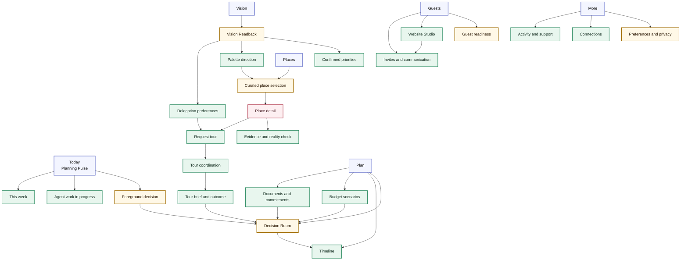
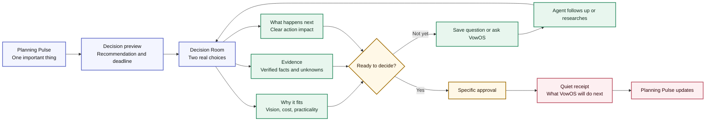
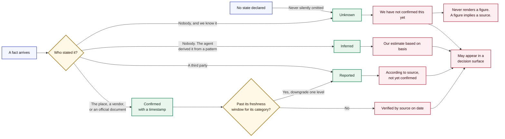
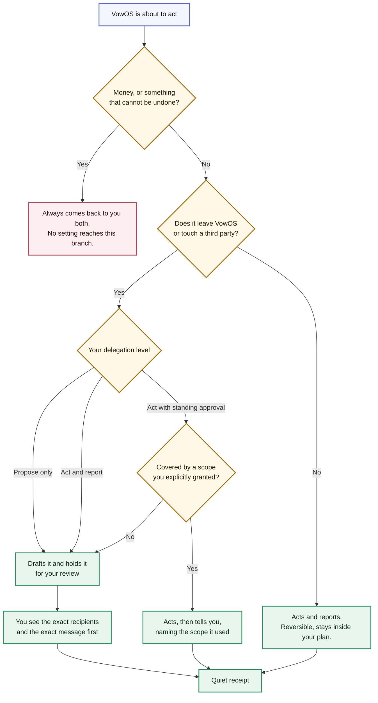

# Diagrams

Sources of truth for the four system diagrams. Each renders inline below and each has a .mmd file beside this one.

## Workspace hierarchy

The intentionally shallow information architecture. Every route supports one of the couple's real questions, and the Decision Room is reachable from Today, Places, or Plan when a meaningful choice is ready.

_Source: `docs/diagrams/vowos_ui_information_architecture.mmd`_

## Calm decision loop

The primary behavioural pattern. VowOS presents a recommendation, its evidence, and the effect of acting. If the couple is not ready, it returns to useful work rather than creating pressure.

_Source: `docs/diagrams/vowos_ui_decision_flow.mmd`_

## Trust states

How a fact becomes something the product is allowed to say. Masterplan section 3, implemented in prototype/js/model.js.

_Source: `docs/diagrams/vowos_trust_states.mmd`_

## Delegation model

What VowOS may do on its own, and the branch no setting can reach around. Masterplan section 4.

_Source: `docs/diagrams/vowos_delegation_model.mmd`_
